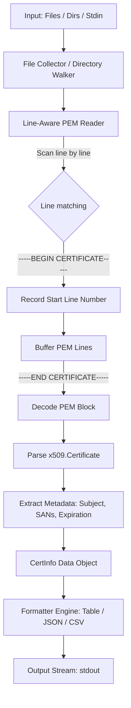

# CertScanner (`certscanner`)

`certscanner` is a lightweight, high-performance Go CLI utility designed to inspect X.509 certificate files (PEM format). It extracts and displays **line numbers**, **subjects**, **domain names (SANs + CN)**, and **expiration dates** for single certificates as well as multi-certificate bundle files.

---

## Features

- **Multi-Certificate Single-File Support**: Accurately scans files containing multiple concatenated certificates (e.g. CA bundles, `fullchain.pem`).
- **Exact Line Number Tracking**: Reports the 1-indexed line number where each certificate block (`-----BEGIN CERTIFICATE-----`) starts in the file.
- **Extracted Metadata**:
  - Line Number
  - Subject DN & Common Name
  - Domains (Subject Alternative Names / DNSNames + Common Name)
  - Issuer DN
  - Expiration Date (`NotAfter`) & Expiration Status (`X days left`, `EXPIRING SOON`, `EXPIRED`)
- **Flexible Input Sources**: Accepts single files, multiple files, recursive directory scanning (`-r` for `.pem`, `.crt`, `.cer`, `.cert`, `.ca-bundle`), or stdin stream piping (`cat cert.pem | certscanner`).
- **Multiple Output Formats**: Supports aligned text tables (`table`), structured JSON (`json`), and CSV (`csv`).

---

## Installation & Building

### Prerequisites
- Go 1.20 or later installed on your system.

You can move the generated `certscanner` binary to your system PATH (e.g., `/usr/local/bin/`) to use it globally.

### Cross-Platform Compilation

Because `certscanner` uses 100% pure Go standard library code with no C dependencies (`CGO_ENABLED=0`), you can cross-compile single binaries for any OS from any machine:

```bash
# Build for Linux (64-bit)
GOOS=linux GOARCH=amd64 go build -o certscanner-linux-amd64 .

# Build for Windows (64-bit)
GOOS=windows GOARCH=amd64 go build -o certscanner-windows-amd64.exe .

# Build for macOS (Apple Silicon M1/M2/M3/M4)
GOOS=darwin GOARCH=arm64 go build -o certscanner-darwin-arm64 .

# Build for macOS (Intel)
GOOS=darwin GOARCH=amd64 go build -o certscanner-darwin-amd64 .
```

---

## Comparison with Existing Tools

| Feature | `certscanner` | `openssl x509` | `certigo` (Square) |
| --- | --- | --- | --- |
| **Multi-cert bundle support** | ✅ Reads all certs in file | ❌ Only reads 1st cert | ⚠️ Parses blocks |
| **Exact source line numbers** | ✅ **Yes** (e.g. Line 4, 52) | ❌ No | ❌ No |
| **Tabular summary view** | ✅ Built-in | ❌ Raw text dump | ⚠️ Tree view |
| **JSON & CSV exports** | ✅ `-o json`, `-o csv` | ❌ Requires scripting | ⚠️ JSON only |
| **Zero external dependencies** | ✅ Pure Go binary | ❌ Requires OpenSSL | ✅ Pure Go binary |
| **Cross-Platform Single Binary**| ✅ Windows, Mac, Linux | ⚠️ Requires OS install | ✅ Windows, Mac, Linux |

## Usage Guide

```bash
certscanner [options] [file|dir ...]
```

### Options

| Flag | Long Flag | Default | Description |
| --- | --- | --- | --- |
| `-s` | `--text` | `""` | Pass PEM certificate text directly as a string |
| `-o` | `--output` | `table` | Output format: `table`, `json`, `csv` |
| `-r` | `--recursive` | `false` | Recursively scan directories for cert files |
| `-h` | `--help` | `false` | Display help and usage information |

---

### Examples

#### 1. Scan a Single Certificate File
```bash
./certscanner cert.pem
```
**Output:**
```text
LINE   SUBJECT                           DOMAIN(S)                              EXPIRE DATE               STATUS
1      CN=app.example.com,O=Sample Org   app.example.com, www.app.example.com   2026-11-06 21:18:44 UTC   89 days left
```

#### 2. Copy and Paste Directly (Interactive Stdin)
Run `certscanner` without arguments, paste your certificate text, and press `Ctrl+D`:
```bash
./certscanner
# Prompt: Paste PEM certificate content below and press Ctrl+D when done:
# [Paste your certificate here]
# Press Ctrl+D
```

#### 3. Pass Inline Certificate Text via `-s` / `--text`
```bash
# Pass clipboard content on macOS:
./certscanner -s "$(pbpaste)"

# Pass raw string:
./certscanner -s "-----BEGIN CERTIFICATE-----..."
```

#### 4. Scan a Multi-Certificate Bundle File
```bash
./certscanner bundle.crt
```
**Output:**
```text
FILE          LINE   SUBJECT                               DOMAIN(S)                             EXPIRE DATE               STATUS
bundle.crt    4      CN=api.example.com,O=Sample Org       api.example.com, v1.api.example.com   2026-08-23 21:18:44 UTC   EXPIRING SOON (14 days left)
bundle.crt    28     CN=expired.example.com,O=Sample Org   expired.example.com                   2026-07-29 21:18:44 UTC   EXPIRED (10 days ago)
bundle.crt    52     CN=ca.internal.com,O=Sample Org       ca.internal.com                       2027-08-08 21:18:44 UTC   364 days left
```

#### 5. Scan Multiple Files or Directories Recursively
```bash
./certscanner -r /etc/ssl/certs/
```

#### 6. Pipe Input via Stdin
```bash
cat cert.pem | ./certscanner
```

#### 7. Output as JSON or CSV
```bash
# JSON Output
./certscanner -o json bundle.crt

# CSV Output
./certscanner -o csv bundle.crt
```

---

## Architecture & System Design

### High-Level Architecture



### Design Principles

1. **Line-Aware PEM Block Parser (`ScanReader`)**:
   Standard `encoding/pem` in Go (`pem.Decode`) operates on raw byte buffers without tracking line numbers. `certscanner` implements a custom line-buffered scanner using `bufio.Scanner`. It tracks line numbers (1-indexed) as lines are read, capturing the line number of `-----BEGIN CERTIFICATE-----` headers before assembling the complete PEM block for `x509.ParseCertificate`.

2. **Domain Normalization & Deduplication**:
   Certificate domain names are extracted by combining Subject Common Name (`cert.Subject.CommonName`) with Subject Alternative Names (DNS SANs `cert.DNSNames` and IP SANs `cert.IPAddresses`), maintaining unique domain lists without duplicate entries.

3. **Decoupled Formatting**:
   The parsing engine yields a slice of strongly typed `CertInfo` structs. Output rendering (`table`, `json`, `csv`) is decoupled from the parser, allowing seamless addition of new formats in the future.

### Component Overview

- **[`cert.go`](file:///Users/jason.rupert/CodingProjects/CertScanner/cert.go)**: Contains `CertInfo` struct, `ScanReader`, `ScanFile`, and `extractCertInfo` functions.
- **[`main.go`](file:///Users/jason.rupert/CodingProjects/CertScanner/main.go)**: Handles CLI flag parsing, directory walking, file discovery, and output formatting (`renderTable`, `renderJSON`, `renderCSV`).
- **[`cert_test.go`](file:///Users/jason.rupert/CodingProjects/CertScanner/cert_test.go)**: Unit tests for single and multi-cert file parsing with line precision.

---

## Development & Testing

Run unit tests:
```bash
go test -v ./...
```
